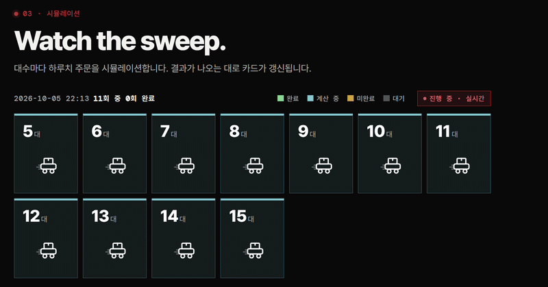
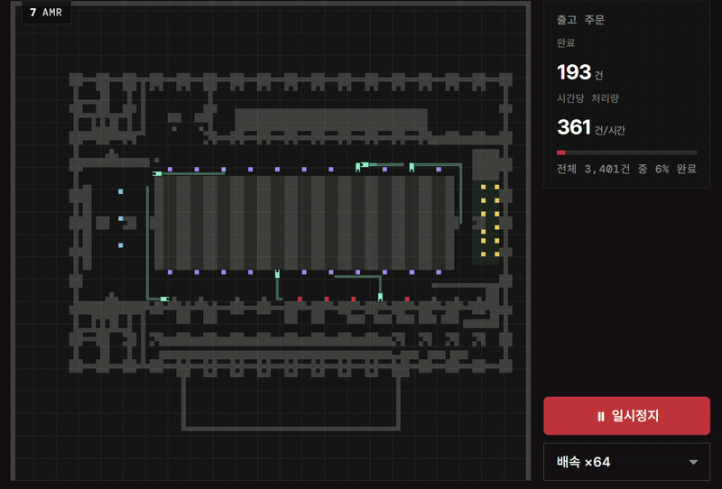
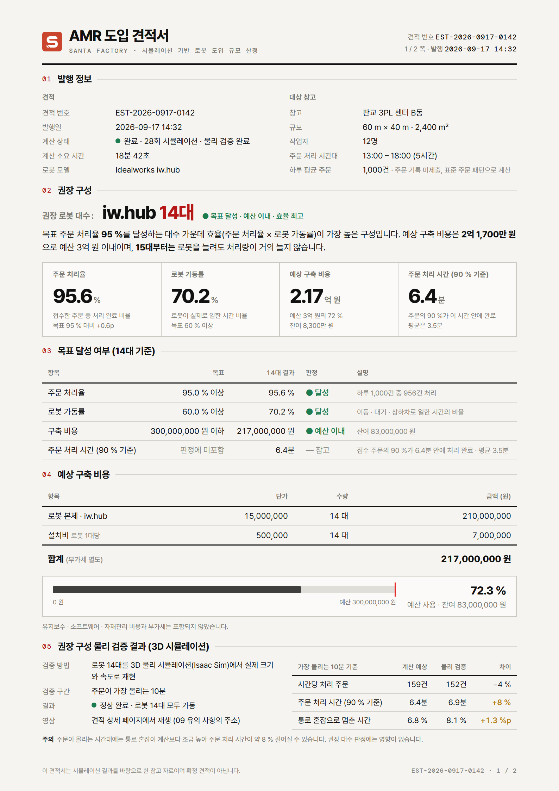
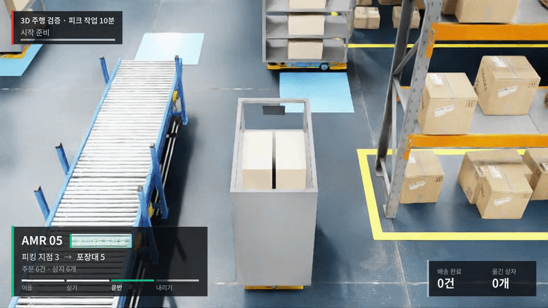
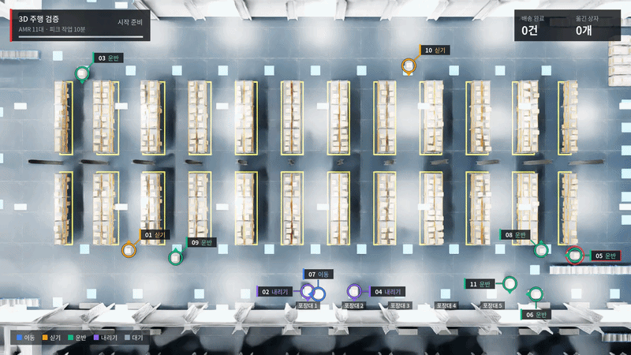
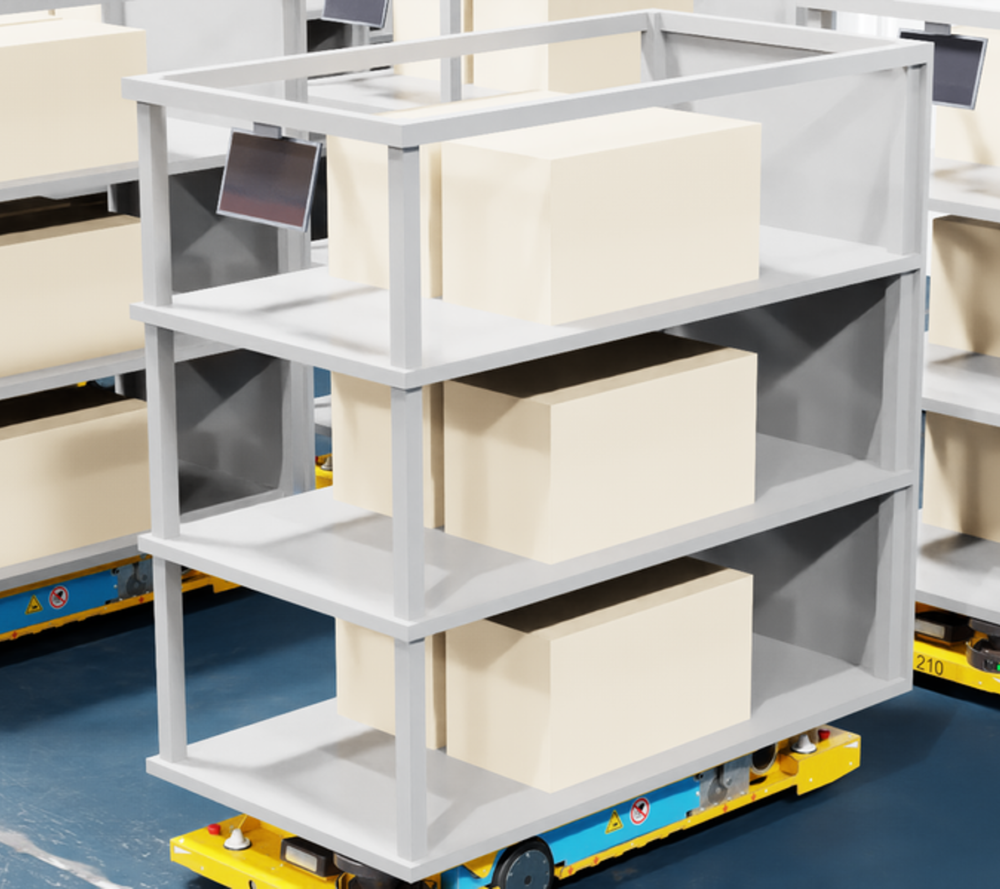
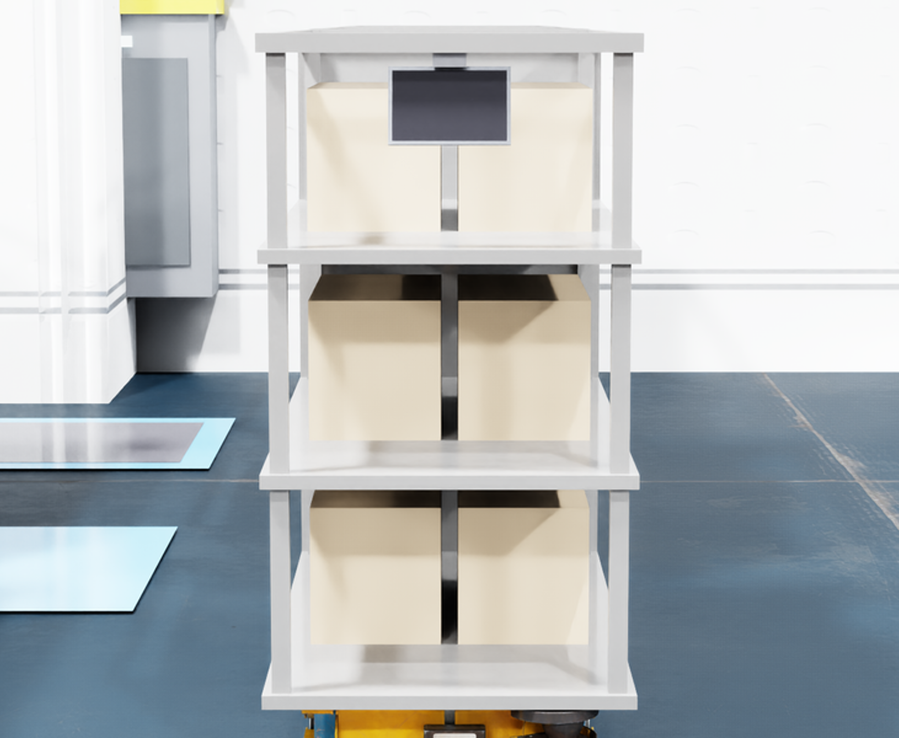
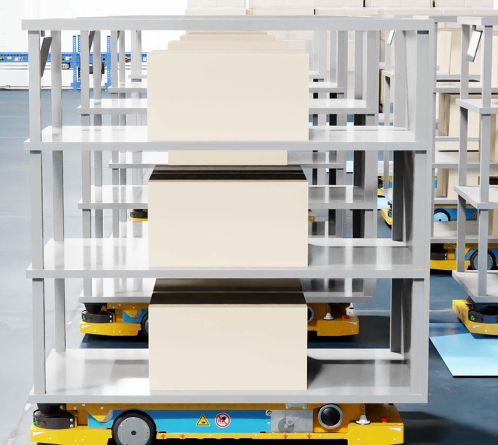

# Santa Factory — 물류센터 AMR 도입 견적 서비스

SSAFY 15기 특화 프로젝트 (A106팀) · 2026.08.24 ~ 2026.10.01 (6주)

> **안내**
> 전체 프로젝트 소스코드는 SSAFY에 **반출 신청(승인)이 필요**하여 이 저장소에 포함하지 못했습니다. 양해 부탁드립니다.
> 이 저장소에는 프로젝트 개요, 제가 맡은 **Isaac Sim 물리 실행 계층과 3D 주행 검증**의 진행 내용, 그리고 결과 화면·영상([`docs/`](docs/))과 최종 발표 자료만 정리했습니다.

---

## 1. 프로젝트 소개

창고의 크기·작업 시간·하루 주문량과 목표(주문 처리율·로봇 가동률)·예산을 입력하면, 로봇 대수별로 하루 운영을 **이산 시뮬레이션**해 필요한 AMR 대수와 구축 비용을 산정합니다. 그다음 가장 붐비는 10분을 **Isaac Sim 물리 환경에서 다시 주행해 검증**하고, 결과를 견적서(PDF)로 제공하는 서비스입니다.

> 감이 아닌 시뮬레이션으로 최적의 AMR을

### 해결하려는 문제

물류센터에 AMR(자율 이동 로봇)을 도입하려 할 때

1. 몇 대가 필요한지 경험이나 업체 제안에 기대어 판단해야 하고
2. 로봇을 늘려도 통로가 막혀 처리량이 대수에 비례해 늘지 않으며
3. 계산한 대수가 실제 로봇의 가감속·회전·차체 크기에서도 통하는지 도입 전에 확인하기 어렵습니다.

### 주요 기능

- 창고 도면·운영 조건 입력, 대수별 하루 운영 시뮬레이션 (결과가 나오는 대로 화면 갱신, 2D 리플레이)
- 목표 처리율·가동률·예산을 만족하는 **권장 대수 자동 산출**
- 권장 대수 주변을 **Isaac Sim 3D 주행으로 검증** (피크 작업 10분, 접촉·최소 간격·지연, 2시점 영상) ← 담당
- 견적서 PDF 다운로드 및 메일 발송

### 시스템 구성

```text
 브라우저(React) ──REST/SSE── Spring Boot (k3s, EC2) ── PostgreSQL · Redis · MinIO
                                   │
                         RabbitMQ (AMQPS)
                           │                 │
       DES 워커 ×12 (k3s, GCP Spot)      host-orch ──MQTT Sparkplug B (EMQX)── Isaac Sim 러너 (GPU)
       PIBT 이산 시뮬레이션 · 피크 10분 추출                                     물리 주행 · 녹화 → MinIO
```

- **이산 시뮬레이션(FMS):** 창고를 1 m 칸으로 나누고 PIBT 경로계획으로 로봇 대수별 6시간 운영을 계산합니다. 견적 하나는 대수별 작업으로 쪼개져 워커 12개가 병렬로 처리합니다.
- **물리 검증:** 이산 시뮬레이션이 찾은 가장 붐비는 10분의 궤적을 Isaac Sim에서 실제 로봇 모델로 다시 주행해, 충돌 없이 돌 수 있는지와 얼마나 늦어지는지를 확인합니다.

### 전체 구성

<table>
<tr>
<td width="33%" align="center"></td>
<td width="33%" align="center"></td>
<td width="33%" align="center"></td>
</tr>
<tr>
<td align="center"><b>대수별 시뮬레이션</b><br>견적 하나를 대수별 작업으로 나눠 병렬 실행<br>결과가 나오는 대로 카드 갱신</td>
<td align="center"><b>이산 시뮬레이션 리플레이</b><br>PIBT로 움직이는 로봇과<br>실시간 처리량</td>
<td align="center"><b>견적서 PDF</b><br>권장 대수·목표 달성 여부<br>구축 비용·3D 검증 결과</td>
</tr>
</table>

### 기술 스택

| 영역 | 기술 |
| --- | --- |
| Frontend | React 19, React Router, Vite |
| Backend | Java 21, Spring Boot 3.3, Spring Security(JWT 쿠키), JPA, Flyway, PostgreSQL, Redis, Thymeleaf + Gotenberg(PDF) |
| Simulation (FMS) | Python, NumPy, Numba, PIBT 경로계획, MLP(통행 규칙 파라미터 예측) |
| Physics | NVIDIA Isaac Sim 6.0, USD, Python |
| Messaging / Storage | RabbitMQ(AMQPS), EMQX(MQTT Sparkplug B), MinIO |
| Infra | AWS EC2, GCP Spot VM, k3s, Docker, Nginx, Jenkins, Tailscale |

### 팀 구성과 역할

| 이름 | 역할 | 주요 담당 | 커밋 |
| --- | --- | --- | ---: |
| **김형수 (본인)** | 물리 시뮬레이션 | **Isaac Sim 물리 실행 계층**(이산 궤적 → ADG 주행), 3D 주행 검증 러너·녹화, AMR 모델 저작, 물리 실측으로 이산 모델 보정 | **299** |
| 신재령 (팀장) | FMS / AI / Web | 창고 맵, 통행 규칙 파라미터 예측 모델(MLP), 백엔드·프론트엔드 기능 | 232 |
| 박화랑 | FMS | 이산 시뮬레이션 엔진(PIBT 경로계획·교착 해소·Numba 최적화), 시뮬레이션 실행 계약 | 157 |
| 이승민 | Infra / 검증 | GCP·k3s 워커 배포, MinIO·EMQX, 검증 오케스트레이션(host-orch), 검증 러너 배포 | 147 |
| 최아영 | Web / Infra | 백엔드·프론트엔드, 리플레이 조회 최적화, k3s 웹 전환 | 121 |

커밋 수는 원본 GitLab 저장소 `develop` 브랜치 기준(merge 제외, 2026-10-01 조회)입니다. 커밋 습관(작게 자주 / 크게 한 번)에 따라 크게 달라지므로 기여량을 그대로 나타내지는 않습니다.

---

## 2. 담당: Isaac Sim 물리 실행 계층 · 3D 주행 검증

이산 시뮬레이션은 로봇을 1 m 칸 위의 점처럼 움직여 6시간 운영을 1분 안팎에 계산합니다. 하지만 실제 로봇은 가감속하고, 제자리에서 돌고, 1.5 m 차체가 옆 칸을 쓸고 지나갑니다. 이산 결과가 실제 로봇에서도 통하는지 확인하려고, **이산 시뮬레이션이 낸 경로를 Isaac Sim의 물리 로봇으로 다시 주행시키는 실행 계층**과 검증 파이프라인을 맡았습니다.

```text
FMS(이산) ── 피크 10분 궤적 ──▶ host-orch ──MQTT Start──▶ Isaac Sim 러너 (GPU)
                                                           │
     궤적 → 동작 추출(전진·회전·후진, 차지하는 칸) → ADG(동작 의존 그래프) → 차동구동 제어 · 물리 주행
                                                           │
Spring ◀── 검증 결과(접촉·최소 간격·지연·수행률) ── host-orch ◀──┘        + 2시점 영상 → MinIO
```

### 완성 결과

<table>
<tr>
<td width="50%" align="center"><a href="docs/isaac_sim/demo_verify_48_n11_1.mp4"></a></td>
<td width="50%" align="center"><a href="docs/isaac_sim/demo_verify_48_n11_1_fpv.mp4"></a></td>
</tr>
<tr>
<td align="center"><b>상단 시점</b> — AMR 11대 · 피크 작업 10분<br>로봇별 단계(이동·싣기·운반·내리기·대기)와 배송 완료 수</td>
<td align="center"><b>로봇 추종 시점</b><br>로봇 한 대의 작업 단계와 실은 상자</td>
</tr>
</table>

견적 48번의 11대 검증 1회차에서 5초씩 발췌한 GIF입니다. 누르면 전체 영상(10분 구간을 2분 12초로 압축)으로 이동합니다.

<table>
<tr>
<td width="33%" align="center"></td>
<td width="33%" align="center"></td>
<td width="33%" align="center"></td>
</tr>
</table>

Isaac Sim에서 쓴 AMR 모델입니다. 구동부(iw.hub)에 3단 적재 선반과 HMI 태블릿을 직접 저작해 올렸고, 차체 치수(1.50 × 0.80 m)가 이산 시뮬레이션의 회전·충돌 규칙에 그대로 쓰입니다.

### 실행 계층 구조 — 시간표가 아니라 순서

이산 계획은 "몇 틱에 어느 칸"이라는 시간표지만, 물리 로봇은 가감속과 미끄러짐 때문에 시간표를 지킬 수 없습니다. 그래서 절대 시각을 버리고 **"누가 먼저 그 칸을 쓰는가"라는 순서만 남긴 ADG(Action Dependency Graph)** 로 바꿔 주행합니다. 늦은 로봇이 있어도 순서만 지키면 충돌 없이 같은 결과에 도달합니다.

| 칸 종류 | 의미 | 순서를 거는 조건 | 동작 완료 조건 |
| --- | --- | --- | --- |
| **hard** | 몸이 실제로 지나가는 칸 (축 칸·뒤 칸·회전 시 뒤쪽 3칸) | 다른 로봇의 몸 칸과 겹치면 항상 | 차체가 그 칸에서 빠져나와야 함 |
| **soft** | 회전할 때 코만 스치는 앞 칸 | 다른 로봇의 **구동축**이 그 칸을 지날 때만 | 확인하지 않고 바로 놓아줌 |

앞 칸까지 몸처럼 막으면 줄 선 로봇끼리 서로 기다려 교착하고, 무시하면 회전하는 앞부분끼리 부딪칩니다. soft 칸은 그 사이를 표현하기 위한 규칙입니다.

### 진행 과정

| 시기 | 단계 | 내용 |
| --- | --- | --- |
| 09/09 ~ 09/11 | 실행 계층 이관 | PIBT 계획 로더, **ADG 주행 계층**, 주문 스트림·재배차·충전존 복귀, Isaac 러너·녹화 파이프라인을 팀 저장소로 이관 |
| 09/13 | AMR 모델 · 실측 | 3단 적재 선반·HMI 태블릿 USD 저작, 녹화로 **이동·회전 소요시간 실측**(90° 회전 1.511 s), FMS의 격자 1.0 m 제안에 실측 근거로 답신 |
| 09/14 | 연속 주행 | 칸마다 서지 않고 직진을 이어가는 연속 주행, 차체 겹침을 거리로 판정 |
| 09/16 | 회전 교착 진단 | 회전 직후 멈추는 교착의 기하 원인 진단 도구, 통신 지연 예산 측정, 6시간 판 ADG 메모리 문제 해결 |
| 09/17 ~ 09/18 | FMS 궤적 그대로 실행 | FMS 궤적을 재계획 없이 실행, 격자·홈·헤딩·회전 마스크 정합, **완료 판정에서 soft 칸 제외**, 후진 속도 배수 실측 |
| 09/20 ~ 09/21 | 교착 제거 | **ADG 틱 순위**(순환 0), **회전 관문 양보**(대기 −62%), 렌더 없는 헤드리스 주행 |
| 09/22 | 정밀도 · 검증 기준 | **도착 판정에 정지 조건 추가**(최소 차체 틈 5.6배), 검증 창을 **시뮬레이션 시간 기준**으로 |
| 09/23 | 검증 영상 | 두 번째 시점 녹화, 따라갈 로봇 자동 선택, 프레임 원자적 쓰기 |

### 핵심 결과

같은 시드로 바꾸기 전과 후를 비교했습니다. 아래 비교에서 차체 접촉은 모두 0건입니다.

| 개선 | 조건 | 전 | 후 |
| --- | --- | --- | --- |
| 도착 판정에 정지 조건 | 13대 · 시드 104 | 최소 차체 틈 3.39 mm | **19.04 mm (5.6배)** · 주행 시간 +1.4% |
| 회전 관문 양보 | 12대 · 시드 104 | 회전 포기 14건 · 대기 8,400프레임 | **4건 · 3,179프레임 (−62%)** · 완주 −5.0% |
| ADG 틱 순위 | 3시드 × 12·16·24대 | 꼬리 반영 시 순환 15개 (시드 101 · 12대) | **9판 전부 순환 0** |
| ADG 간선 인접 쌍 | 24대 · 5시드 | 간선 14만~25만, 6시간 판 외삽 5.8억 개 · 14.8 GB | **간선 82.7~89.7% 감소** · 주행 결과 비트 동일 |
| 검증 창 기준 | 13대 | 벽시계 600 s 창에 시뮬레이션 219 s (36%) | 모든 회차가 시뮬레이션 10분 |

**물리 실측 → 이산 모델 보정**

| 실측 | 값 | 반영 |
| --- | --- | --- |
| 90° 제자리 회전 | **1.511 s** (12대 · 301 s 녹화, 표본 54건) — 기존 근거값 0.76 s의 2배 | FMS 틱 모델 개정의 입력 (전진 1칸 4틱 : 회전 5틱) |
| 후진 속도 배수 | **3.11~3.14배** (전진 0.818 / 후진 0.260 m/s) — 가정 3.0 확인 | FMS v3.15: 후진 1칸 12틱으로 실행 시간에도 반영 |
| 바퀴 상수 | 반경 **0.08 m** · 간격 **0.58 m** (에셋 조인트·컨트롤러 값 대조) | 팀 값 0.115 / 0.413 m로는 실제 속도가 명령의 0.696배 → 계획·실행 공용 상수 파일로 고정 |

### 문제 해결 사례

**1. 회전을 마치고도 끝나지 않는 동작 — 완료 판정에서 soft 칸 제외**
90° 회전을 마친 로봇이 "완료"되지 않아 그 뒤에 걸린 로봇까지 멈추고 판이 끝나지 않았습니다. 완료 조건이 코만 스치는 앞 칸(soft)에서도 차체가 빠져나오길 요구했는데, 회전은 제자리 동작이라 밀린 축을 되돌릴 수단이 없었습니다. 대책 후보 셋(soft 제외 / 옆 밀림 보정 이득 상향 / soft 조기 해제)을 각각 측정 도구로 검증해 반례가 나온 둘을 버리고 soft 제외를 채택했습니다. 빠진 안전 근거는 측정으로 다시 세웠습니다(축이 105 mm 밀려도 여유 100 mm, 실측 밀림 p95 11.7 mm). 대책이 실제로 걸렸는지는 "일찍 놓는 칸 수"로 로그에 남겼습니다.

**2. 기다리다 밀고 들어가던 회전 — 셋째 선택지, 양보**
회전 관문은 대기 한도(10 s)를 넘기면 그대로 밀고 들어갔고, 차체 접촉 3건의 마지막 단계가 모두 이 경로였습니다. "접촉 위험 vs 영구 교착"의 이분법으로 설계한 것이 원인이었습니다. 상대가 기다리는 원인이 내 회전이면 그 의존 간선을 면제해 상대를 먼저 보내고, 회전은 계속 기다리게 했습니다. 회전 포기가 14건에서 4건으로, 대기 프레임이 62% 줄었고 완주도 5.0% 빨라졌습니다.

**3. 오차가 공차를 따라다닌다 — 도착 판정에 정지 조건**
로봇 사이 최소 틈이 3.39 mm까지 좁아졌습니다(회전 기하 예산 41.3 mm의 8.2%). 도착 판정이 허용 반경의 가장자리에 닿는 순간 완료를 내서, 회전 위치오차 중앙값 32.32 mm 중 약 30 mm가 허용 공차 그 자체였습니다. 공차를 줄이면 원이 작아질 뿐 여전히 가장자리에 선다고 보고, "서 있는가(0.02 m/s 이하)"를 도착 조건에 더해 감속이 목표까지 끝나게 했습니다. 최소 틈은 19.04 mm(5.6배)가 됐고 주행 시간은 1.4% 늘었습니다. 제대로 선 뒤 출발하니 뒤 로봇이 덜 막혀 정체 스텝은 오히려 4.5% 줄었습니다.

**4. 칸마다 뒤집히는 순서 — ADG 틱 순위**
기다리는 로봇의 꼬리까지 보도록 제약을 넓히자 ADG에 순환이 15개 생겼습니다. 칸을 공유하는 두 동작의 순서를 "그 칸을 이미 가진 쪽이 먼저"로 정했는데, 이 기준이 칸마다 달라 같은 쌍이 칸에 따라 반대로 정렬된 것이 원인이었습니다. 순위를 칸마다가 아니라 틱마다 한 번 위상정렬로 정하게 바꿔, 3시드 × 12·16·24대 9판 모두 순환 0을 만들었습니다. 기존 제약 134,090개를 새 순위로 전수 검사해 뒤집히거나 빠진 것이 없음을 확인했고, 대가인 임계경로 증가(+2.2 ~ +10.8%)도 함께 기록했습니다.

**5. 6시간 판이 메모리에 안 들어가던 ADG — 간선을 인접 쌍만**
짧은 판(1,260틱 · 12대)에서는 1.4초면 끝나던 ADG 구축이, 6시간 판(77,760틱 · 24대)에서는 간선 5.8억 개 · 14.8 GB로 외삽됐습니다. 같은 칸을 지나는 모든 동작 쌍에 간선을 걸어 제곱으로 늘던 규칙을, 이분 탐색으로 바로 앞·뒤 하나씩만 걸게 바꿨습니다. 빠진 간선이 전부 전이로 도달하는지(5시드 전수)와 주행 결과가 비트 단위로 같은지를 확인한 뒤 기본값으로 옮겼고, 간선은 82.7~89.7% 줄었습니다.

**6. 판마다 다른 10분 — 검증 창을 시뮬레이션 시간으로**
검증 창을 벽시계(600 s)로 끊었더니 13대 판에서 시뮬레이션은 219 s만 돌고 끝났습니다. Isaac Sim 배속이 판마다 0.33 ~ 1.64배로 달라 같은 창이 다른 분량을 돌았고, 견적 지표는 모두 시뮬레이션 초 기준이라 분모가 서로 달랐습니다. 러너가 지금까지 돈 시뮬레이션 시각을 MQTT 메트릭으로 보내고 host-orch가 그 값으로 창을 끊게 바꿨습니다. 창을 못 채운 느린 판은 조용히 완료되지 않고 실패로 드러나며, 기존 테스트 86개로 이전 동작을 지켰습니다.

### 한계

- 최번시 처리량은 이산 계획의 15.7%에 그쳤습니다(09/22, 13대 측정). 순서는 지켜 접촉 없이 돌지만 가감속·회전 대기로 늦어지는 몫이 커, 검증 결과는 "충돌 없이 돌 수 있는가"와 "얼마나 늦어지는가"(지연·수행률)로 해석합니다.
- 대부분의 비교는 같은 시드로 돌린 한두 판의 전후 비교라 통계적 신뢰구간은 내지 못했습니다.
- ADG가 순서를 지켜도 기하 여유는 얇습니다(설계 여유 41.4 mm = 최고 속도로 46 ms 이동). 브로커를 거치며 위치 관측이 늦어지면 이 여유를 먹으므로, 통신 지연 예산을 따로 측정해 두었습니다.
- GPU 서버는 한 대이고 EC2와는 Tailscale 임시 경로로 연결되어 있어, 러너 확장은 아직입니다.

---

## 3. 포함 파일 — [`docs/`](docs/)

| 경로 | 내용 |
| --- | --- |
| [`docs/isaac_sim/`](docs/isaac_sim/) | 3D 주행 검증 영상 2개(상단·추종 시점)와 5초 발췌 GIF |
| [`docs/AMR/`](docs/AMR/) | 적재 선반 AMR 모델 렌더 3장 |
| [`docs/fms/fms.gif`](docs/fms/fms.gif) | 이산 시뮬레이션 2D 리플레이 |
| [`docs/infra/fms_multicore.gif`](docs/infra/fms_multicore.gif) | 대수별 시뮬레이션이 워커 병렬로 진행되는 화면 |
| [`docs/pdf/`](docs/pdf/) | 견적서 PDF 예시 1·2면 |
| `A106 최종발표_10-01_v4.pptx` | 최종 발표 자료 |

---

## 4. 회고

이산 시뮬레이션이 계산한 결과를 Isaac Sim의 물리 로봇으로 다시 주행시키는 실행 계층을 맡았습니다. 이산 쪽에서는 로봇이 칸과 틱 단위로 깔끔하게 움직이지만, 물리 쪽 로봇은 가감속하고 제자리에서 돌며 차체가 옆 칸을 쓸고 지나갑니다. 계획을 시간표대로 따르게 하면 금방 어긋나서, 순서만 지키는 ADG로 바꾼 것이 출발점이었습니다.

가장 오래 걸린 건 교착이었습니다. 원인을 따라가 보면 대부분 로봇이 느려서가 아니라, 같은 규칙을 두 층이 다르게 해석하거나 완료·도착 같은 판정 기준이 규칙과 어긋난 곳에서 생겼습니다. 그럴듯한 대책이 여러 개일 때는 각각 측정 도구를 만들어 반례를 찾은 뒤에 골랐고, 개선할 때는 얻은 것과 함께 대가(주행 시간, 임계경로 증가)도 같이 기록했습니다.

다른 팀원이 만든 이산 시뮬레이션과 결과를 맞대려면 같은 격자, 같은 궤적, 같은 시간 기준이 먼저 맞아야 했습니다. 회전·후진 시간을 실측해 이산 쪽 시간 모델 개정의 근거로 넘긴 것처럼, 두 층이 같은 기준을 보게 만드는 일이 결과를 믿을 수 있게 하는 전제라는 걸 배웠습니다.

아쉬운 점은 물리 처리량이 이산 계획에 크게 못 미치는 원인을 끝까지 줄이지 못한 것입니다. 시드를 더 늘려 통계적으로 비교하지 못한 것도 남은 과제입니다.
